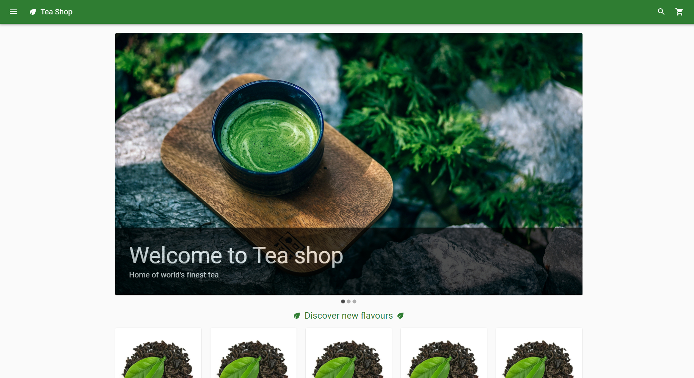
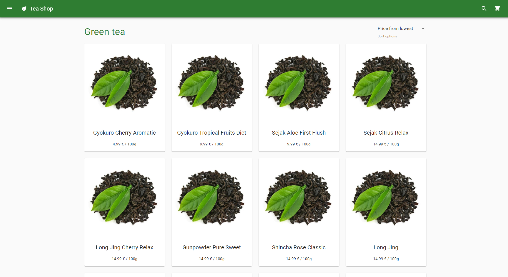
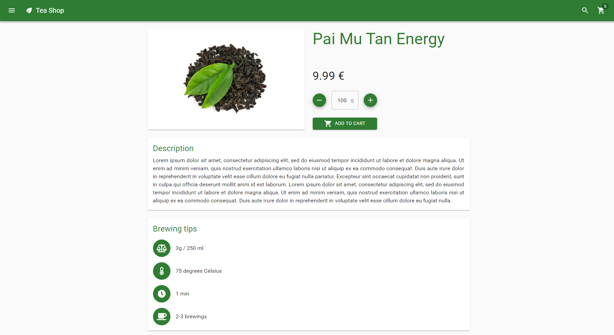
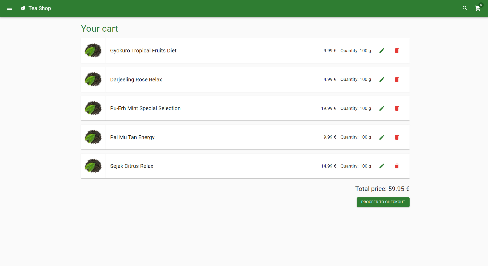
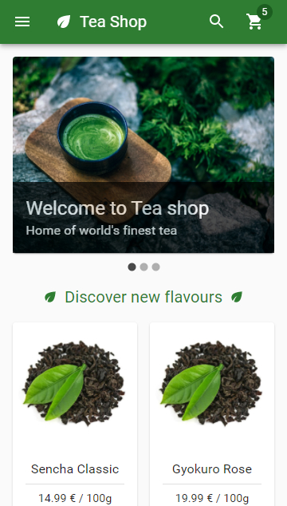
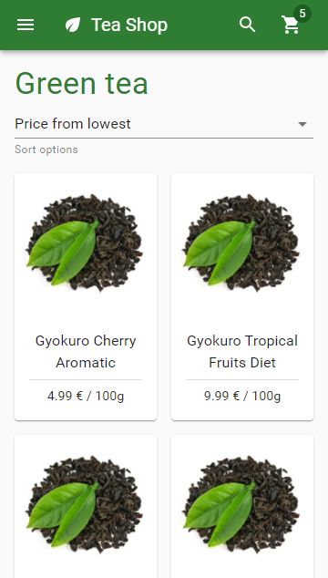
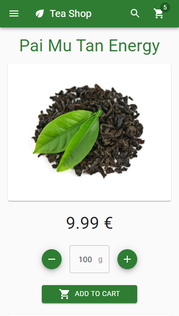
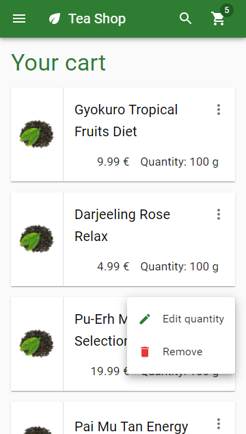

# Teashop

Teashop is an e-commerce web application for selling tea related products. It was created for the purpose of acquiring and mastering skills in web application development.

## Usage

To quickly setup the application, run the setup script (setup.bat for Windows, setup.sh for Linux). You need to have [Git](https://git-scm.com/) and [Docker](https://www.docker.com/) installed on your machine.

After setup, you can run the application with command:
```
docker-compose up
```

If you want to run the application in the background then use:
```
docker-compose up -d
```

After that, you can visit the application in your browser at [localhost](http://localhost)

For more information, see [Teashop Ops](https://github.com/lukaszslazyk/teashop-ops) repository.

## Features

- Displaying home page with recommended products
- Browsing products in categories
    - sorting products by price and name
    - pagination
- Searching for products by name
- Displaying product details page
- Adding product to cart
    - user chooses quantity of product to add
    - products can by priced by weight (tea products) or not (accessories)
- Displaying cart page
    - editing quantity of product in cart
    - deleting product from cart
- Placing order
    - user provides the following information:
        - email
        - shipping address
        - billing address (same as shipping address by default)
        - shipping method
        - payment method
    - summary is displayed before placing order
    - confirmation is displayed after placing order with link to order page
- Displaying order page
    - displays order summary (provided information, order lines and costs)

## Screenshots

<div align="center">
    <h3>Desktop</h3>
    
    
    
    
</div>

<div align="center">
    <h3>Mobile</h3>
    
    
    
    
</div>

## Development plan

To be implemented in next steps:
- Auth:
    - features:
        - user registration
        - user login
        - editing user information
        - displaying orders placed by user
        - saving addresses to be used in next checkout
    - technical details:
        - auth functionalities as separate service
        - OAuth + OpenID Connect support
- Mailing:
    - features:
        - sending order confirmation e-mail
        - sending user registration confirmation e-mail
    - technical details:
        - mailing functionalities as separate service
        - connected with main back-end service via message queue (ex. RabbitMQ) to send emails asynchronously and avoid forcing user to wait too long for order placement